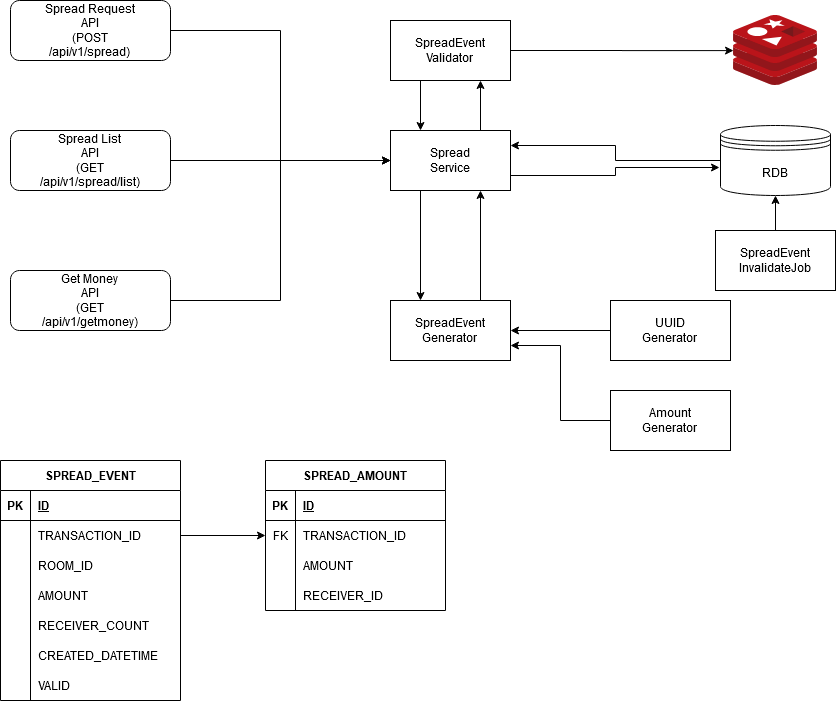

## Showerhead
물 대신 돈을 뿌리는 샤워기


### Diagram


### Tech Stack

- Kotlin
- MySQL
- Redis(Redisson)
- Spring Boot
- Spring Data JPA
- JUnit5

### Prerequisites

- 애플리케이션 구동 전 로컬에 redis-server 인스턴스가 실행중이여야 합니다. 

### Strategy

- 핵심 컴포넌트에 대한 단위 테스트를 진행한다.
    - 핵심 컴포넌트에는 **도메인 클래스** 와 **서비스 클래스** 를 포함한다. 
    - Presentation layer 이전의 모든 컴포넌트가 구현한 요구사항에 대해 테스트한다.
- *10분간만 뿌리기 요청이 유효하다* 는 요구사항에 착안하여, 뿌리기 요청을 캐싱한다. 
    - 실제 RDBMS에서의 `SELECT` 이전에 유효하지 않은 요청은 튕겨낸다. 
- 고유한 token을 만들기 위해 `UUID` 를 사용한다. 
- 멀티 인스턴스 환경을 지원하기 위해 *분산 락* 을 사용한다. 
    - Redisson client의 `RLock` 사용한다.

### API Requests

```http request
POST http://localhost:8080/api/v1/spread
Content-Type: application/json
X-ROOM-ID: abc
X-USER-ID: {{testable_requester_id}}

{"request_amount" :  60000, "request_receiver_count" :  5}

###

GET http://localhost:8080/api/v1/getmoney/{{transactionId}}
Content-Type: application/json
X-ROOM-ID: abc
X-USER-ID: {{testable_user_id}}


###

GET http://localhost:8080/api/v1/details/{{transactionId}}
Content-Type: application/json
X-ROOM-ID: abc
X-USER-ID: {{testable_requester_id}}
```

### API Responses

- 뿌리기 이벤트 생성 요청(/api/v1/spread)
```json
{
  //이벤트 ID
  "generatedTransactionId": "2a3"
}
```

- 뿌리기 수금 요청(/api/v1/getmoney/{transactionId})
```json
{
  "receiverId": "zella.ddo",
  "amount": 34449
}
```

- 뿌리기 현황 조회 요청(/api/v1/details/{transactionId})
```json
{
  "createdDateTime": "2020-09-22 01:17:25",
  "amount": 60000,

  //받기 완료된 금액 
  "takenAmount": 33662,

  //받기 상세 정보
  "takenDetails": [
    {
      "receiverId": "zella.ddo",
      "amount": 33662
    }
  ]
}

```

